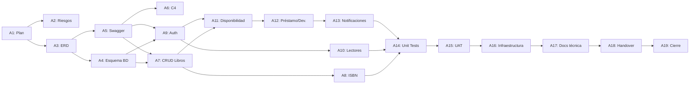

# 🔗 Dependencias - Biblioteca Digital v1.0

## Dependencias Finish-to-Start (FS)

| Tarea | Depende de | Justificación |
|-------|-----------|--------------|
| A2 | A1 | No se registran riesgos sin plan aprobado |
| A3 | A1 | El ERD parte del alcance definido en el plan |
| A4 | A3 | El esquema BD requiere el ERD finalizado |
| A5 | A3 | La API se basa en el modelo de datos |
| A6 | A5 | El diagrama C4 describe los componentes de la API |
| A7 | A4, A5 | El CRUD necesita BD + contrato API definidos |
| A8 | A7 | El validador ISBN se integra al módulo de libros |
| A9 | A4, A5 | La autenticación necesita BD + API definidas |
| A10 | A9 | La gestión de lectores depende del sistema de auth |
| A11 | A7, A9 | La disponibilidad cruza módulo libros y usuarios |
| A12 | A11 | El flujo préstamo/devolución requiere disponibilidad |
| A13 | A12 | Las notificaciones se disparan desde el flujo de préstamo |
| A14 | A8, A10, A13 | Las pruebas requieren todos los módulos completos |
| A15 | A14 | UAT solo después de pruebas técnicas aprobadas |
| A16 | A15 | Infraestructura se configura con producto validado |
| A17 | A16 | Documentación técnica sobre entorno estable |
| A18 | A17 | Handover requiere documentación completa |
| A19 | A18 | Cierre después de transferencia a operaciones |

## 🕸️ Red de Dependencias (Mermaid)

